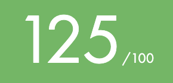
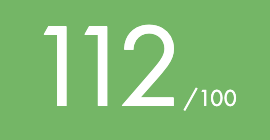
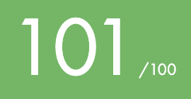
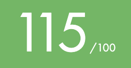

## 👋 Hi there

My name is **Apolline Vast** and I am a student at [42 School](https://42.fr/) and a graduate from ESCP Business School.\
I embarked on my coding journey at 42 and I finished the Core Curriculum in February 2024. 

## 🚀 My progress at 42
<!--
### My level 🎯💯📊

### 42 Projects 💻
-->
| Project          | Language      | Subject          | Score                                                |    
|-----------------:|--------------:|-----------------:|:----------------------------------------------------:|
|             Libft|              C|        Algorithms|<a href="https://projects.intra.42.fr/projects/42cursus-libft/projects_users/2868472">
|     get_next_line|              C|        Algorithms|
|       Born2beroot|           Bash|    Virtualization|
|         ft_printf|              C|        Algorithms|
|               FdF|              C|          Graphics|
|         push_swap|              C|        Algorithms|
|             pipex|              C|              UNIX|
|         minishell|              C|              UNIX|
|      Philosophers|              C|   Mutli-threading|
|       NetPractice|           none|           Network|
|            miniRT|              C|          Graphics|
|               CPP|            C++|               OPP|
|         Inception|  Docker & Bash|    Virtualization|
|            ft_irc|            C++|            Server|
|  ft_transcendence|     TypeScript|               Web|

