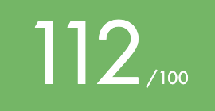
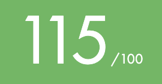

## 👋 Hi there

My name is **Apolline Vast** and I am a student at [42 School](https://42.fr/) and a graduate from ESCP Business School.\
I embarked on my coding journey at 42, in the November 2022 Piscine. I finished the Core Curriculum in February 2024. 

## 🚀 My progress at 42
### My level

### My Projects
| Project                                                        | Language      | Subject          | Score                                                |    
|---------------------------------------------------------------:|--------------:|-----------------:|:----------------------------------------------------:|
|                      <a href="subjects/libft.subject.pdf">Libft|              C|        Algorithms|<a href="https://projects.intra.42.fr/projects/42cursus-libft/projects_users/2868472">
|      <a href="subjects/get_next_line.subject.pdf">get_next_line|              C|        Algorithms|<a href="https://projects.intra.42.fr/projects/42cursus-get_next_line/projects_users/2876202">
|          <a href="subjects/born2beroot.subject.pdf">Born2beroot|           Bash|    Virtualization|<a href="https://projects.intra.42.fr/projects/born2beroot/projects_users/2882766">
|              <a href="subjects/ft_printf.subject.pdf">ft_printf|              C|        Algorithms|<a href="https://projects.intra.42.fr/projects/42cursus-ft_printf/projects_users/2894662">
|                          <a href="subjects/fdf.subject.pdf">FdF|              C|          Graphics|<a href="https://projects.intra.42.fr/projects/42cursus-fdf/projects_users/2917621">
|              <a href="subjects/push_swap.subject.pdf">push_swap|              C|        Algorithms|<a href="https://projects.intra.42.fr/projects/42cursus-push_swap/projects_users/2941688">
|                      <a href="subjects/pipex.subject.pdf">pipex|              C|              UNIX|<a href="https://projects.intra.42.fr/projects/pipex/projects_users/2930188">
|              <a href="subjects/minishell.subject.pdf">minishell|              C|              UNIX|<a href="https://projects.intra.42.fr/projects/42cursus-minishell/projects_users/3008614">
|         <a href="subjects/philosphers_subject.pdf">Philosophers|              C|   Mutli-threading|<a href="https://projects.intra.42.fr/projects/42cursus-philosophers/projects_users/2995680">
|         <a href="subjects/net_practice.subject.pdf">NetPractice|           none|           Network|<a href="https://projects.intra.42.fr/projects/netpractice/projects_users/3066282">
|                    <a href="subjects/miniRT.subject.pdf">miniRT|              C|          Graphics|<a href="https://projects.intra.42.fr/projects/minirt/projects_users/3077658">
|                                      <a href="subjects/CPP">CPP|            C++|               OPP|<a href="https://projects.intra.42.fr/projects/cpp-module-09/projects_users/3314037">
|              <a href="subjects/inception.subject.pdf">Inception|  Docker & Bash|    Virtualization|<a href="https://projects.intra.42.fr/projects/inception/projects_users/3315596">
|                    <a href="subjects/ft_irc.subject.pdf">ft_irc|            C++|            Server|<a href="https://projects.intra.42.fr/projects/ft_irc/projects_users/3394157">
|<a href="subjects/ft_transcendance.subject.pdf">ft_transcendence|     TypeScript|               Web|<a href="https://projects.intra.42.fr/projects/ft_transcendence/projects_users/3443717">

